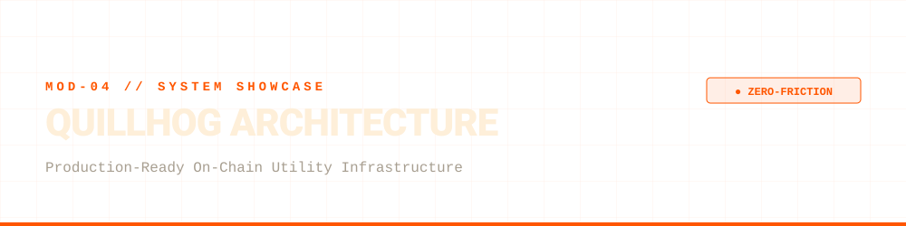

<div align="center">
  
</div>

<br>

Quillhog is a suite of high-reliability, low-footprint microservices built for the Solana ecosystem. Our guiding engineering principle is simple: **Utilities that actually work, without friction, bloat, or surveillance.**

Traditional crypto tools force users through broken user experiences—demanding wallet connections for simple tasks, routing payments through corporate gateways that track IP addresses, or requiring KYC verification just to export public blockchain data. Quillhog was engineered from the ground up to eliminate these bottlenecks.

---

## ⚙️ Core Architectural Principles

### <kbd>A</kbd> Zero-Friction Payment Matching (No-Wallet-Connect)
* **The Challenge:** Traditional Web3 apps rely on heavy frontend wallet extensions (Phantom, Solflare) to initiate and track payments, introducing friction and security risks.
* **Our Solution:** We engineered a deterministic, server-side payment verification engine utilizing unique micro-amount assignment. Users execute a direct, peer-to-peer transfer without connecting a wallet to our interface. The system identifies and pairs the on-chain transaction instantly and autonomously, preserving 100% user anonymity.

### <kbd>B</kbd> High-Concurrency Database Design (SQLite WAL Mode)
* **The Architecture:** Designed for isolated transactional lifecycles and background worker queues using a dual-database pattern.
* **Reliability:** Enforces Write-Ahead Logging (WAL) alongside custom exponential backoff wrappers (`@retry_on_lock`). This eliminates database lock contention under heavy concurrency and ensures zero data corruption during unexpected system faults.

### <kbd>C</kbd> Fail-Safe Asynchronous Worker Daemons
* **The Mechanics:** Background tasks (such as blockchain data extraction and archive generation) are managed by autonomous worker daemons featuring atomic job claiming (`UPDATE ... RETURNING`).
* **Self-Healing:** Integrated heartbeat monitoring continuously tracks worker liveness. If a worker process is terminated abruptly, orphaned tasks are automatically detected, safely recovered, and routed without human intervention.

### <kbd>D</kbd> Multi-Tier RPC Failover Pool
* **Resilience:** To protect against third-party provider outages, rate limits (HTTP 429), and network partitions, our communication layer utilizes an intelligent RPC pool with automatic endpoint rotation and jittered backoff strategies.

---

## 📦 The Output Standard (Accountant-Ready)

Every transactional export generated by our pipeline is packaged into a standardized, secure ZIP envelope containing three strict operational files:

| File | Structure & Purpose |
| :--- | :--- |
| `00_READ_FIRST.md` | Mandatory compliance disclaimers and structured metadata. |
| `transactions.csv` | Clean, normalized tabular data (ISO timestamps, type, amounts, network fees, counterparty, and transaction signatures). |
| `raw_data.json` | Comprehensive structured audit log for deep inspection. |

---

## 💻 Public Code Snippet: Robust RPC Failover Pattern

As a demonstration of our commitment to system resilience, below is a structural excerpt of our network failover and retry management logic:

```python
import logging
import time
import requests

logger = logging.getLogger(__name__)

class RpcFailoverPool:
    """
    Manages a pool of Solana RPC endpoints with automatic rotation 
    on network errors, rate limits (HTTP 429), and retryable codes.
    """
    def __init__(self, endpoints: list[str]):
        self.endpoints = endpoints
        self.current_index = 0

    def get_active_endpoint(self) -> str:
        return self.endpoints[self.current_index]

    def rotate(self):
        self.current_index = (self.current_index + 1) % len(self.endpoints)
        logger.warning(f"Rotating Solana RPC endpoint to: {self.get_active_endpoint()}")
